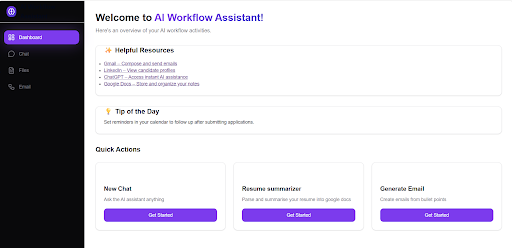
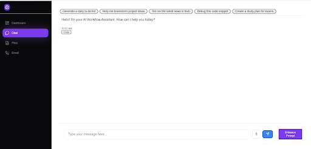
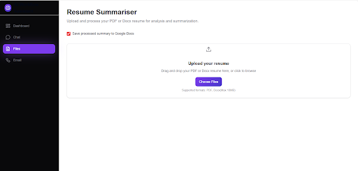
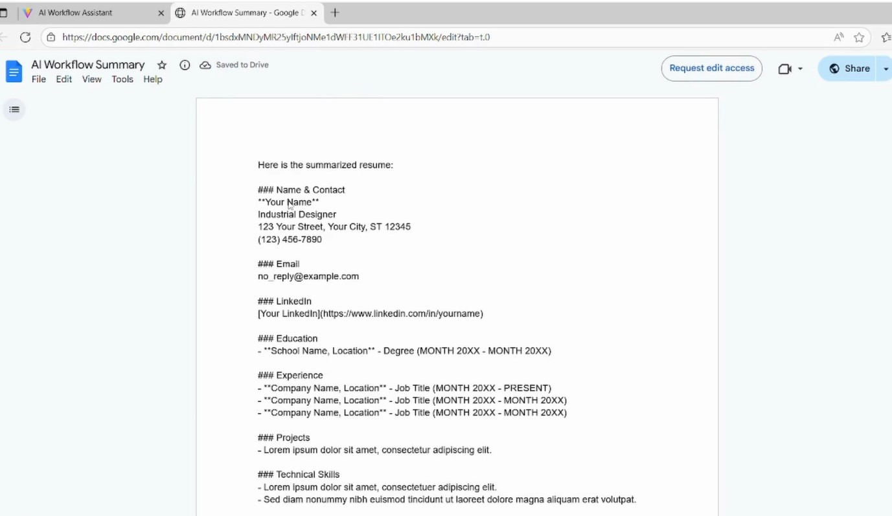
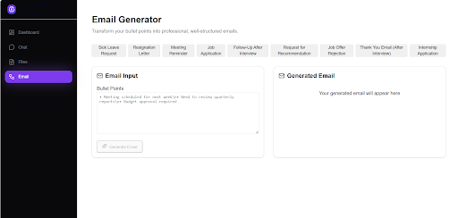

# AI Workflow Assistant

## Overview

**AI Workflow Assistant** is an intelligent productivity tool designed to automate common tasks such as **resume parsing, resume summarization, document saving, email generation and web data extraction**.
It combines **LLMs**, **custom tools**, and a **modular workflow system** to streamline real-world workflows in a single assistant interface.

This project demonstrates how **AI agents** can be integrated with external APIs and user data to build practical assistants for everyday use.

## ✨ Features

* 🗂 **Resume Parser** – Upload `.pdf` / `.docx` resumes, automatically extract structured data.
* 📝 **Summarization** – Generate concise summaries of extracted or scraped text from resumes.
* 📄 **Google Docs Integration** – Save parsed resumes directly into Google Docs.
* 📧 **Email Generation** – Automatically draft professional emails based on user input or workflow output
* 🌐 **Web Scraping Tool** – Extract and process website content for quick insights.
* 💬 **Chat Interface** – Interact with the assistant in real time.
* 🧠 **LLM-powered Workflows** – Built using OpenRouter’s GPT-4.0-Turbo for intelligent responses.
* ⚡ **Modular Architecture** – Easily extend workflows with new tools.

## 🏗️ Architecture
```mermaid
flowchart LR
    A[User] --> B[React Frontend]
    B --> C[FastAPI Backend]
    C --> D[OpenRouter LLM (GPT-4.0 Turbo)]
    C --> E[Tools]
    E --> E1[Resume Parser]
    E --> E2[Summarizer]
    E --> E3[Google Docs API]
    E --> E4[Email Generator]
    E --> E5[Web Scraper]
```
AI Model: OpenRouter (GPT-4.0 Turbo)
Tools: Resume Parser, Summarizer, Google Docs Writer,Email generator, Web Scraper
Workflow Engine: LangChain / LangGraph Agents

## ⚙️ Tech Stack

* **Frontend**: React, Axios, CSS
* **Backend**: FastAPI, Uvicorn
* **AI/LLM**: OpenRouter API (GPT-4.0 Turbo)
* **Tools**: Google Docs API, Web Scraping, Summarizer, Resume Parser, Email generator
* **Others**: LangChain, dotenv, pydantic


## 📂 Project Structure

```bash
ai-workflow-assistant/
│
├── backend/
│   ├── app/
│   │   ├── api/              # API routes
│   │   ├── models/           # Pydantic models
│   │   ├── services/         # Core services
│   │   ├── utils/            # Tools (scraper, docs, summarizer, etc.)
│   │   ├── main.py           # FastAPI entrypoint
│   │   ├── routes.py         # Route handling
│   │   └── agent_logic.py    # LLM agent workflows
│   ├── .env                  # API keys and secrets
│   └── requirements.txt
│
├── frontend/
│   ├── src/
│   │   ├── components/       # Chat UI, forms, etc.
│   │   ├── pages/            # Main views
│   │   └── App.js            # Entry point
│   ├── public/
│   └── package.json
│
└── README.md
```

## ⚡ Installation & Setup

### Backend

```bash
# Clone repository
git clone https://github.com/mahnoorirfan80/ai-workflow-assistant.git
cd ai-workflow-assistant/backend

# Create virtual environment
python -m venv venv
venv\Scripts\activate     

# Install dependencies
pip install -r requirements.txt

# Add environment variables in .env
OPENROUTER_API_KEY=your_openrouter_key
```

Start server:

```bash
uvicorn app.main:app --reload
```
### Frontend

```bash
cd ../frontend

# Install dependencies
npm install

# Run development server
npm start
```

##  Usage

* Open the **frontend app** in your browser.
* Use the **chat interface** to ask the AI to parse and summarise a resume, generate emails, or scrape a website.
* Upload a `.pdf` / `.docx` file → Assistant extracts + summarizes → Saves summary in **Google Docs**.
* **Generate a professional email** draft directly from the assistant → Assistant outputs a formatted email you can copy or save.

##  Deployment

* **Frontend**: Deployed on Vercel
* **Backend**: Runs locally via FastAPI and is exposed to the internet using ngrok for secure tunneling.
* Start FastAPI locally → uvicorn app.main:app --reload
* Run ngrok to generate a public HTTPS URL: ngrok http 8000
* Use the generated https://xxxxx.ngrok-free.app URL in your frontend .env or API config.

## ⚠️ Notes on ngrok

* Every time you restart ngrok, you get a new URL unless you have a paid/static domain.
* Make sure to update the frontend with the latest backend URL.
* For production, this backend can be deployed to Render, Railway, or Docker on a VPS to avoid the ngrok dependency.

## Demo Screenshots

* Dashboard 
  

* Chat UI  
  

* Resume Parsing Workflow  
  

* Google Docs Output  
  

* Email Generator
  


  
## 🚧 Future Improvements

*  User authentication & role-based access
*  Planned integration with Gmail/Outlook APIs so that emails can be directly sent instead of just generated.
*  Calendar tool (fetch + add events)
*  Slack / Notion integration
*  Persistent memory with database
*  Multi-language support

